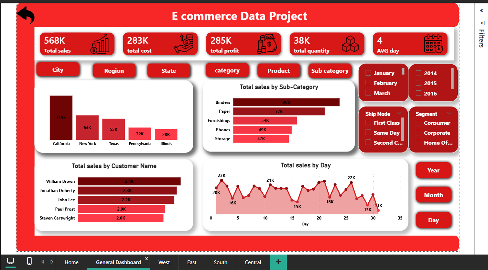
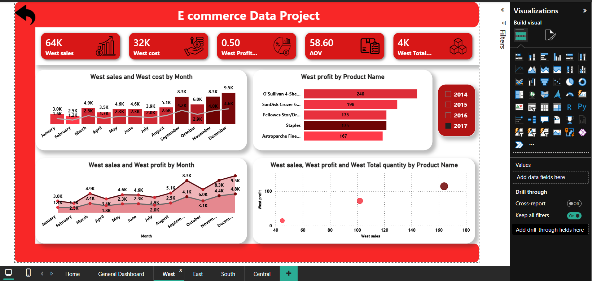
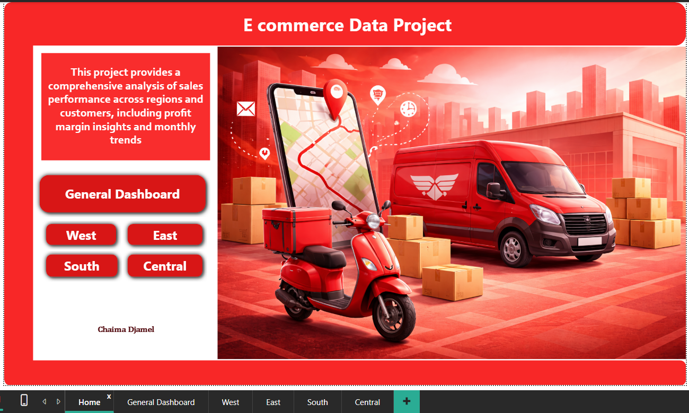
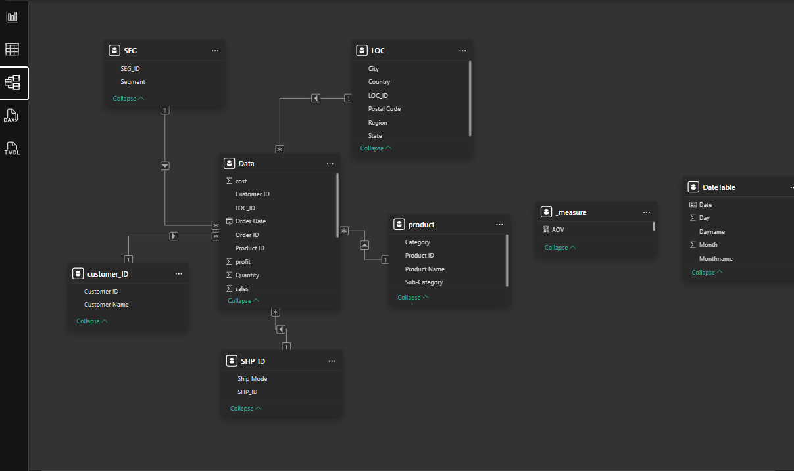
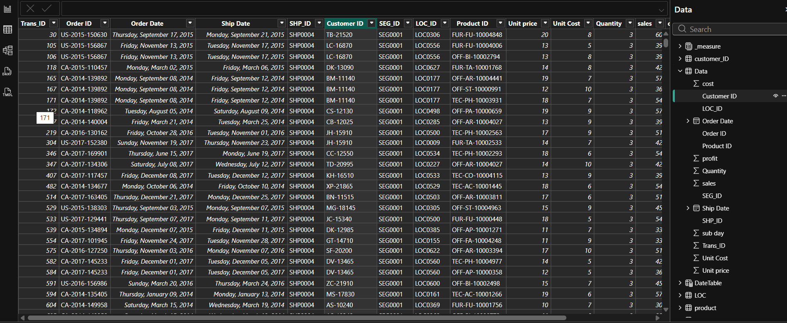

# E-Commerce Sales Analysis Dashboard (Power BI)

This project presents an interactive **Power BI dashboard** designed to analyze e-commerce sales performance across regions, customers, and products.  
The goal of this project is to transform raw sales data into clear business insights through data modeling and interactive visualizations.

---

## Project Overview

The dashboard provides a comprehensive analysis of sales performance including:

- Total sales, cost, profit, and quantity
- Regional sales comparison
- Customer purchasing behavior
- Product performance
- Sales trends over time

The report is designed with a focus on **clear visualization, interactive filtering, and user-friendly navigation** to support data-driven decision making.

---

## Dashboard Structure

The Power BI report contains **multiple interactive pages**:

### 1️⃣ Home Page
Provides an overview of the project and quick navigation to the dashboard sections.

### 2️⃣ General Dashboard
Displays key business metrics including:

- Total Sales
- Total Cost
- Total Profit
- Total Quantity
- Average Order Value

It also includes visualizations such as:

- Sales by state
- Sales by sub-category
- Top customers
- Sales trend over time

### 3️⃣ Regional Dashboards

Separate pages analyze sales performance by region:

- West
- East
- South
- Central

Each regional page provides detailed insights about:

- Sales performance
- Profit and cost trends
- Product performance

---

## Data Model

The data model follows a **Star Schema structure** to improve analytical performance.

Main tables include:

**Fact Table**
- Sales Data

**Dimension Tables**

- Customer
- Product
- Location
- Segment
- Shipping
- Date Table

This structure allows efficient filtering and aggregation across multiple dimensions.

---

## Key Features

- Interactive filters and slicers
- Regional performance analysis
- Customer sales insights
- Product category analysis
- Time-based sales trends
- Clean and user-friendly dashboard layout

---

## Dashboard Preview

### General Dashboard

### West Region Dashboard

### Home Page

### Data Model

### Dataset

---

## Tools Used

- Power BI
- Data Modeling
- DAX Measures
- Interactive Dashboard Design

---

## Business Questions Answered

This dashboard helps answer key business questions such as:

- Which region generates the highest sales?
- Which products are the most profitable?
- Who are the top customers?
- What are the peak sales periods?

---

Chaima Djamel  
Data Analyst
